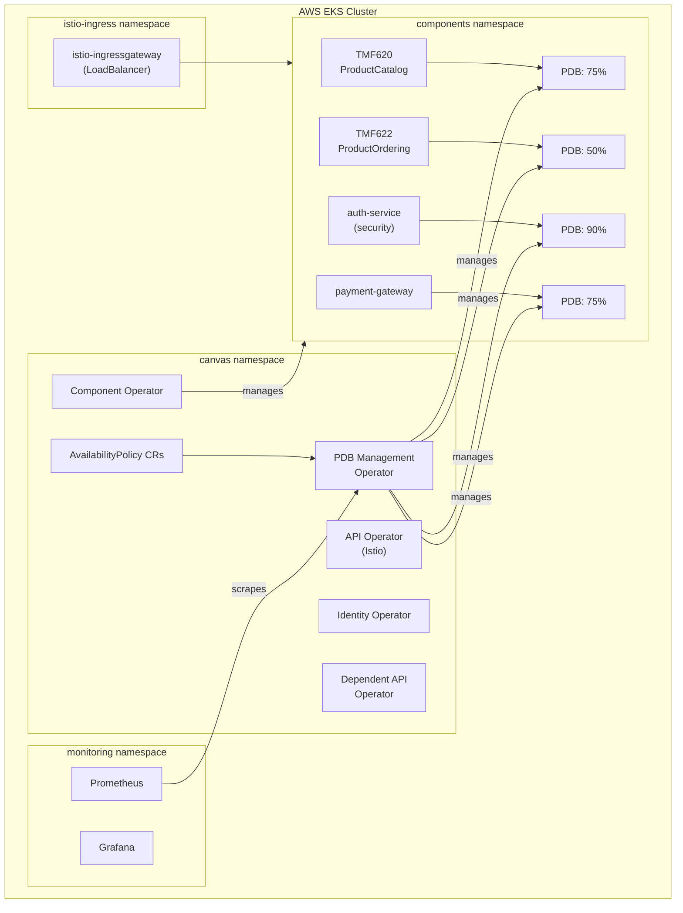
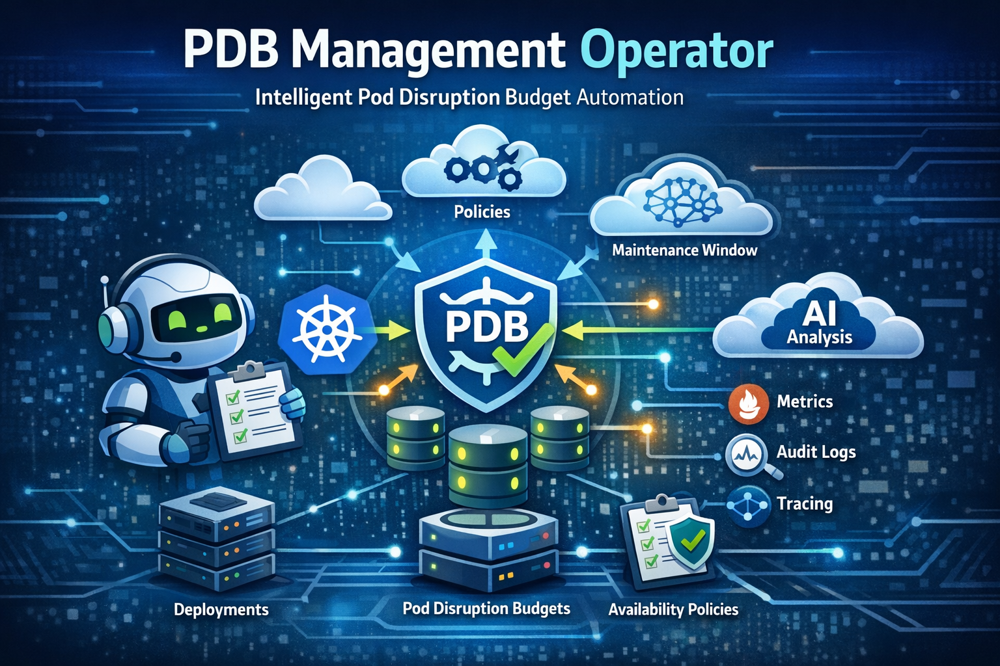

# PDB Management Operator Demo

This repository provides a complete demonstration environment for the **PDB Management Operator** running on TM Forum ODA Canvas. It deploys an EKS cluster with all necessary components to showcase automated Pod Disruption Budget management.

## Table of Contents

- [Overview](#overview)
- [Architecture](#architecture)
- [Step-by-Step Installation](#step-by-step-installation)
  - [1. Provision EKS Cluster](#1-provision-eks-cluster)
  - [2. Install ODA Canvas Stack](#2-install-oda-canvas-stack)
  - [3. Deploy Demo Components](#3-deploy-demo-components)
  - [4. Deploy Availability Policies](#4-deploy-availability-policies)
- [Demo Scenarios](#demo-scenarios)
  - [Scenario 1: Annotation-Based PDB Creation](#scenario-1-annotation-based-pdb-creation)
  - [Scenario 2: Strict Policy Enforcement](#scenario-2-strict-policy-enforcement)
  - [Scenario 3: Flexible Policy with Minimum Class](#scenario-3-flexible-policy-with-minimum-class)
  - [Scenario 4: Maintenance Windows](#scenario-4-maintenance-windows)
  - [Scenario 5: Policy Priority Resolution](#scenario-5-policy-priority-resolution)
- [Verification Commands](#verification-commands)
- [Observability](#observability)
- [Cleanup](#cleanup)
- [Troubleshooting](#troubleshooting)
- [Resources](#resources)

## Overview

The **PDB Management Operator** is a Kubernetes operator that automatically creates, updates, and manages Pod Disruption Budgets based on deployment annotations and organizational policies.

This demo showcases:

- **Annotation-based PDB creation** - Developers specify availability requirements via annotations
- **Policy-based enforcement** - Platform teams define organization-wide availability standards
- **Enforcement modes** - Strict, flexible, and advisory policy enforcement
- **Security component auto-upgrade** - Automatic availability upgrades for security workloads
- **Maintenance windows** - Scheduled PDB relaxation during maintenance periods
- **Policy priority resolution** - Deterministic conflict resolution when multiple policies match

## Architecture



## Quick Start

For those who want to get up and running quickly:

```bash
# 1. Clone the repository
git clone https://github.com/NoNickeD/pdb-management-operator-demo.git
cd pdb-management-operator-demo

# 2. Provision EKS cluster (takes ~15-20 minutes)
cd infrastructure
tofu init
tofu apply -var-file=conf/deploy.tfvars
cd ..

# 3. Install everything (ODA Canvas, Istio, Observability)
task setup

# 4. Deploy demo components and policies
task deploy:components
task deploy:policies

# 5. Watch PDBs being created
task watch:pdb
```

## Step-by-Step Installation

### 1. Provision EKS Cluster

The infrastructure is defined using OpenTofu/Terraform and creates:

- VPC with public/private subnets across 3 AZs
- EKS cluster (v1.31) with managed node groups
- IAM roles for IRSA (EBS CSI, VPC CNI, Load Balancer Controller)
- AWS Load Balancer Controller for ingress

#### Review Configuration

```bash
cd infrastructure
cat conf/deploy.tfvars
```

Default configuration:

```hcl
region       = "eu-central-1"
cluster_name = "oda-canvas-demo"
# ... see conf/deploy.tfvars for all options
```

#### Initialize and Apply

```bash
# Initialize Terraform/OpenTofu
tofu init

# Preview changes
tofu plan -var-file=conf/deploy.tfvars

# Apply (confirm with 'yes')
tofu apply -var-file=conf/deploy.tfvars
```

This takes approximately **15-20 minutes**. Once complete, you'll see outputs including the cluster endpoint.

#### Configure kubectl

```bash
cd ..
task kubeconfig

# Verify cluster access
kubectl get nodes
```

Expected output:

```
NAME                                            STATUS   ROLES    AGE   VERSION
ip-10-0-12-121.eu-central-1.compute.internal   Ready    <none>   5m    v1.31.x
ip-10-0-24-63.eu-central-1.compute.internal    Ready    <none>   5m    v1.31.x
...
```

### 2. Install ODA Canvas Stack

The `task setup` command installs all required components in order:

```bash
task setup
```

This installs:

1. **Helm repositories** - Adds required chart repos
2. **cert-manager** - TLS certificate management
3. **Metrics Server** - Kubernetes metrics for HPA
4. **Istio** - Service mesh (base, istiod, ingress gateway)
5. **Prometheus + Grafana** - Observability stack
6. **ODA Canvas** - TM Forum ODA platform with PDB Management Operator

Installation takes approximately **10-15 minutes**.

#### Verify Installation

```bash
task status
```

Expected output:

```
=== Canvas Operators ===
NAME                                                READY   STATUS
api-operator-istio-...                              1/1     Running
canvas-pdb-management-operator-...                  1/1     Running
component-operator-...                              1/1     Running
identityconfig-operator-keycloak-...                2/2     Running
...

=== PDBs ===
NAMESPACE      NAME                             MIN AVAILABLE
canvas         canvas-pdb-management-operator   1
```

### 3. Deploy Demo Components

Deploy sample ODA components with various availability configurations:

```bash
task deploy:components
```

This creates:

| Component               | Namespace     | Replicas | Availability Annotation | Function   |
| ----------------------- | ------------- | -------- | ----------------------- | ---------- |
| tmf620-productcatalog   | components    | 4        | high-availability       | core       |
| tmf622-productordering  | components    | 3        | standard                | core       |
| auth-service            | components    | 5        | standard                | security   |
| payment-gateway         | components    | 6        | mission-critical        | core       |
| batch-processor         | components    | 3        | non-critical            | management |
| billing-service-api     | demo-standard | 2        | -                       | -          |
| customer-management-api | demo-critical | 3        | -                       | -          |
| order-management-api    | demo-critical | 4        | -                       | -          |

#### Verify Components

```bash
kubectl get deployments -n components
```

Expected output:

```
NAME                     READY   UP-TO-DATE   AVAILABLE
auth-service             5/5     5            5
batch-processor          3/3     3            3
payment-gateway          6/6     6            6
tmf620-productcatalog    4/4     4            4
tmf622-productordering   3/3     3            3
```

### 4. Deploy Availability Policies

Deploy organizational policies that control PDB behavior:

```bash
task deploy:policies
```

This creates four AvailabilityPolicy resources:

| Policy              | Enforcement | Priority | Target                | Availability Class |
| ------------------- | ----------- | -------- | --------------------- | ------------------ |
| security-strict     | strict      | 1000     | security components   | mission-critical   |
| critical-services   | strict      | 500      | tier=critical labels  | high-availability  |
| production-baseline | flexible    | 100      | all in components ns  | standard (minimum) |
| weekend-maintenance | advisory    | 50       | management components | standard           |

#### Verify Policies

```bash
kubectl get availabilitypolicies -n canvas
```

Expected output:

```
NAME                  AVAILABILITY CLASS   ENFORCEMENT   PRIORITY
critical-services     high-availability    strict        500
production-baseline   standard             flexible      100
security-strict       mission-critical     strict        1000
weekend-maintenance   standard             advisory      50
```

#### Verify PDBs Created

```bash
kubectl get pdb -n components
```

Expected output:

```
NAME                         MIN AVAILABLE   MAX UNAVAILABLE   ALLOWED DISRUPTIONS
auth-service-pdb             90%             N/A               0
batch-processor-pdb          50%             N/A               1
payment-gateway-pdb          75%             N/A               1
tmf620-productcatalog-pdb    75%             N/A               1
tmf622-productordering-pdb   50%             N/A               1
```

## Demo Scenarios

### Scenario 1: Annotation-Based PDB Creation

**Goal**: Demonstrate how developers can request availability levels via annotations.

The `tmf620-productcatalog` deployment uses annotations to request high-availability:

```yaml
# demo/components/product-catalog.yaml
metadata:
  annotations:
    oda.tmforum.org/availability-class: "high-availability"
    oda.tmforum.org/component-function: "core"
```

**Verify**:

```bash
# Check the deployment annotations
kubectl get deployment tmf620-productcatalog -n components -o jsonpath='{.metadata.annotations}' | jq

# Check the created PDB
kubectl get pdb tmf620-productcatalog-pdb -n components -o wide
```

**Expected Result**: PDB with 75% minAvailable (high-availability class for core function).

**Availability Classes Reference**:

| Class             | Core/Management | Security |
| ----------------- | --------------- | -------- |
| non-critical      | 20%             | 50%      |
| standard          | 50%             | 75%      |
| high-availability | 75%             | 75%      |
| mission-critical  | 90%             | 90%      |

### Scenario 2: Strict Policy Enforcement

**Goal**: Demonstrate how platform policies can override developer annotations.

The `auth-service` deployment requests "standard" availability:

```yaml
# demo/components/auth-service.yaml
metadata:
  annotations:
    oda.tmforum.org/availability-class: "standard" # Developer requested
    oda.tmforum.org/component-function: "security"
```

But the `security-strict` policy enforces mission-critical:

```yaml
# demo/policies/security-strict.yaml
spec:
  availabilityClass: mission-critical
  enforcement: strict # Policy always wins
  priority: 1000
  componentSelector:
    componentFunctions:
      - security
```

**Verify**:

```bash
# Check the policy
kubectl get availabilitypolicy security-strict -n canvas -o yaml

# Check auth-service PDB - should be 90% (mission-critical), not 50% (standard)
kubectl get pdb auth-service-pdb -n components
```

**Expected Result**: PDB shows 90% minAvailable despite annotation requesting standard (50%).

**Check Operator Logs**:

```bash
task logs:pdb-operator
```

Look for log entries showing the policy override:

```json
{
  "msg": "Strict enforcement: using policy configuration",
  "policyClass": "mission-critical",
  "annotationClass": "standard"
}
```

### Scenario 3: Flexible Policy with Minimum Class

**Goal**: Demonstrate flexible enforcement where developers can request higher (but not lower) availability.

The `production-baseline` policy sets a minimum standard:

```yaml
# demo/policies/production-baseline.yaml
spec:
  availabilityClass: standard
  enforcement: flexible
  minimumClass: standard # Floor - can't go below this
  componentSelector:
    namespaces:
      - components
    matchExpressions:
      - key: oda.tmforum.org/componentName
        operator: Exists
```

**Test Case 1**: Developer requests higher availability (allowed)

```bash
# tmf620-productcatalog requests high-availability
kubectl get pdb tmf620-productcatalog-pdb -n components
# Result: 75% (high-availability) - developer choice honored
```

**Test Case 2**: Developer requests lower availability (blocked)

```bash
# batch-processor requests non-critical (20%)
kubectl get deployment batch-processor -n components -o jsonpath='{.metadata.annotations}'
# Annotation: non-critical

kubectl get pdb batch-processor-pdb -n components
# Result: 50% (standard) - minimum enforced, not 20%
```

**Expected Result**: Developers can opt for higher protection but cannot reduce below organizational standards.

### Scenario 4: Maintenance Windows

**Goal**: Demonstrate scheduled maintenance window support.

The `weekend-maintenance` policy defines maintenance windows:

```yaml
# demo/policies/maintenance-window.yaml
spec:
  availabilityClass: standard
  enforcement: advisory
  componentSelector:
    componentFunctions:
      - management
  maintenanceWindows:
    - start: "02:00"
      end: "06:00"
      timezone: "UTC"
      daysOfWeek:
        - 0 # Sunday
        - 6 # Saturday
```

**Verify Policy**:

```bash
kubectl get availabilitypolicy weekend-maintenance -n canvas -o yaml
```

**Note**: During the maintenance window (Saturday/Sunday 02:00-06:00 UTC), the PDB constraints are relaxed for management components like `batch-processor`.

### Scenario 5: Policy Priority Resolution

**Goal**: Demonstrate how the operator resolves conflicts when multiple policies match.

For `auth-service`, multiple policies could match:

1. `security-strict` (priority: 1000) - targets security components
2. `production-baseline` (priority: 100) - targets all components

**Resolution Rules**:

1. **Highest priority wins** - security-strict (1000) beats production-baseline (100)
2. **Lexicographic tie-break** - If priorities equal, sorted by name

**Verify**:

```bash
# Check which policy is applied (look at logs)
kubectl logs -n canvas -l app.kubernetes.io/name=pdb-management-operator --tail=100 | grep auth-service
```

Look for:

```json
{
  "msg": "Found matching AvailabilityPolicy",
  "policy": "security-strict",
  "priority": 1000
}
```

**Conflict Metrics**:

```bash
# If using Prometheus, check for policy conflict metrics
kubectl port-forward -n canvas svc/canvas-pdb-management-operator-metrics 8443:8443 &
curl -k https://localhost:8443/metrics | grep policy_conflicts
```

## Verification Commands

### Check All PDBs

```bash
kubectl get pdb -A
```

### Watch PDB Changes in Real-Time

```bash
task watch:pdb
```

### View Operator Logs

```bash
task logs:pdb-operator
```

### Check Component Status

```bash
task status
```

### Describe a Specific PDB

```bash
kubectl describe pdb auth-service-pdb -n components
```

### Check Deployment Events

```bash
kubectl get events -n components --sort-by='.lastTimestamp' | grep -E "(PDB|pdb)"
```

## Observability

### Access Grafana

```bash
task port-forward:grafana
```

Open http://localhost:3000 in your browser.

- **Username**: admin
- **Password**: prom-operator

### PDB Operator Metrics

The operator exports Prometheus metrics:

| Metric                                           | Description                  |
| ------------------------------------------------ | ---------------------------- |
| `pdb_management_pdbs_created_total`              | Total PDBs created           |
| `pdb_management_pdbs_updated_total`              | Total PDBs updated           |
| `pdb_management_reconciliation_duration_seconds` | Reconciliation latency       |
| `pdb_management_enforcement_decisions_total`     | Policy enforcement decisions |
| `pdb_management_policy_conflicts_total`          | Policy conflict occurrences  |

## Cleanup

### Remove Demo Components Only

```bash
task clean:components
```

### Complete Cleanup (Keep Cluster)

```bash
task clean:all
```

### Destroy EKS Cluster

```bash
cd infrastructure
tofu destroy -var-file=conf/deploy.tfvars
```

## Troubleshooting

### PDB Not Created

**Symptoms**: Deployment exists but no PDB created.

**Check**:

1. Deployment has >= 2 replicas (PDBs require multiple replicas)
2. Annotations are correctly spelled (`oda.tmforum.org/availability-class`)
3. Operator is running: `kubectl get pods -n canvas | grep pdb`

```bash
# Check operator logs for errors
task logs:pdb-operator
```

### Policy Not Applied

**Symptoms**: PDB doesn't reflect expected policy.

**Check**:

1. Policy exists: `kubectl get availabilitypolicies -n canvas`
2. Policy selector matches deployment labels/annotations
3. Wait for cache refresh (up to 5 minutes) or restart operator

```bash
# Force reconciliation by restarting operator
kubectl rollout restart deployment canvas-pdb-management-operator -n canvas
```

### Pods Stuck in ContainerCreating

**Symptoms**: Demo component pods won't start.

**Check**:

```bash
kubectl describe pod <pod-name> -n components
```

Common causes:

- Istio sidecar injection timeout (we disabled this for demo)
- Missing secrets or configmaps

### Canvas Installation Stuck

**Symptoms**: `helm install` times out.

**Check**:

```bash
# Check for pending pods
kubectl get pods -n canvas

# Check for certificate issues
kubectl get certificates -n canvas
```

The canvas installation creates certificates as post-install hooks. If stuck, certificates may not have been created yet.

## Resources

- [PDB Management Operator (ODA Canvas)](https://github.com/tmforum-oda/oda-canvas)
- [TM Forum ODA Canvas Documentation](https://github.com/tmforum-oda/oda-canvas)
- [Kubernetes PDB Documentation](https://kubernetes.io/docs/tasks/run-application/configure-pdb/)
- [Operator SDK](https://sdk.operatorframework.io/)


